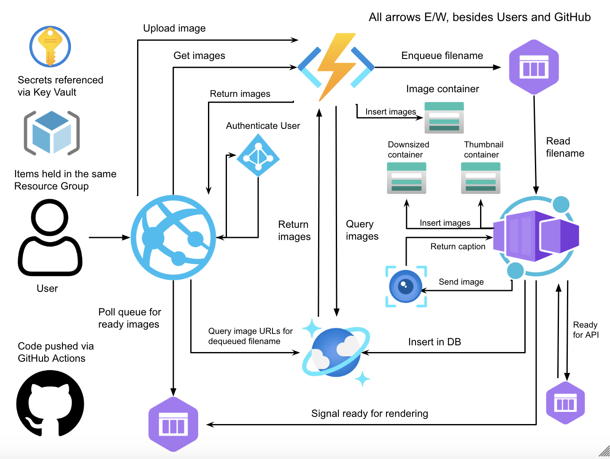

# Deployment Architecture for Photo Library Application

## Overview

This documentation outlines the architecture and components of my photo application. The web application can be visited [here](https://jacob-519-app.azurewebsites.net/) with value BU credentials. The application allows a users to upload photos, and uses Azure Computer Vision to analyze the contents of the image and display the image with a caption.

The process for image analysis works as follows

- Frontend calls Express endpoint /getImages
- Express endpoint calls Azure Function API1 getImages
- Azure Function getImages queries CosmosDB for all saved images
- CosmosDB, Azure Function, and Express server pass images back to frontend for rendering
- On image submit, the filename and image are sent to Azure Function API1 /UpdateFile
- API1 stores the image the Image Container, and enqueues the file name for further processing
- API2 QueueProcessor dequeues the filename and fetches the original image from the Image Container
- QueueProcessor creates a downsized and thumbnail version of the image, and inserts them in their respective containers
- QueueProcessor enqueues the filename in a queue for the Computer Vision API
- ImageAnalysis reads from the queue and calls the Computer Vision API using the link to the image in the Image Container
- ImageAnalysis creates an entry in CosmosDB using the returned caption
- ImageAnalysis enqueues the file name in a queue for the frontend to read
- The frontend polls an Express endpoint which reads from the new queue
- When a filename enters, the Express server fetches the CosmosDB and passes it to the frontend
- The frontend renders the new CosmosDB entry

## Components

### Front-end

#### Description

The frontend is built using React and hosted via Web App on Azure.

You can visit it [here](jacob-519-app.azurewebsites.net). There is a header, loader, photo card, and upload button component which have their own respective function. The upload button component is primarily responsible for interacting with the Express server.

The Express servers contains 3 endpoints

- /api/uploadFile waits for a submission from the button and forwards it to API1
- /api/getImages calls API1 to fetch all images from CosmosDB and passes them back to the frontend
- /api/uploadComplete reads from a queue and fetches the respective CosmosDB entry

#### GitHub Workflow

Whenever a push is made on the main branch, a workflow will propagate changes to the Web App on Azure.

To work locally, you must create your own Web App in Azure and put its name under AZURE_WEBAPP_NAME in the YAML file.

Lastly, you must add the public profile as a secret called AZURE_WEBAPP_PUBLISH_PROFILE.

### API1

#### Description

API1 is hosted on a Function App on Azure.

API1 has two primary functions

- getImages is called by the Express server, and it queries CosmosDB for all entries and returns them to the Express server
- UpdateFile parses the image from the Express server, inserts it in a Container, and passes the filename on to API2

#### GitHub Workflow

Whenever a push is made on Node/API1, a workflow will propoagate changes to the Function App on Azure.

You must create your own function add, and put its name under AZURE_FUNCTIONAPP_NAME in the YAML file.

Lastly, you must add the public profile as a secret called AZURE_FUNCTIONAPP_PUBLISH_PROFILE.

### API2

#### Description

API2 is hosted on a Container App on Azure.

API2 has two primary functions

- QueueProcessor which recieves a filename from API1, creates a downsized and thumbnail version, and passes the filename on for processing by Azure Computer Vision
- ImageProcessor which reads filenames from the queue between itself and QueueProcessor, makes an API calls to Azure Computer Vision, inserts the entry in CosmosDB, and passes the filename on for rendering on the frontend.

#### Container Registry

The container app is hosted on a container registry.

#### GitHub Workflow

You must set up a container registry, and set up the Container App on the registry. The registry and Container App must be under the same subscription and region. The container registry will also start billing your subscription, unlike other Azure tools in this application.

Whenever a push is made on Node/API2, a workflow will propagate changes to the Container App on Azure.

In the YAML file, you must set the registry name, container app name, and resource group name. You must ensure that your environment secrets are configured to point to values in the key vault before starting the workflow. You must also ensure you are using the correct variable names in the code, being the ones declared in the workflow.

### Key Vault

All secrets, such as connection strings, endpoints, and API keys are held within the Key Vault. API1 and the Web App have environment variables in the portal which reference the Key Vault. Secrets are propagated to the Container App via the GitHub workflow file, which is described in more detail above.

### C# Folder

This project can also be implemented using C#. I chose to implement the project using Node, so please ignore the C# folders.

## User Stories

### User Story 1

As a user, I want to be able to log in using my BU Credentials so that I can securely access the photo library.

#### Explanation

My Web App uses Microsoft Identity Provider, which checks for a valid BU Microsoft login. Attempting to access the page without valid credentials will respond with a 302 error, routing the user to a Microsoft login page. If they then input valid BU credentials, they will gain access to the website.

### User Story 2

As a user, I want to have the ability to upload unlimited photos without waiting for each to process, so that I can efficiently add my photos to the library.

#### Explanation

My design uses queues to sequentialize the entire process. Different components (API1, API2) may run concurrently, enabling users to submit multiple images at once, bounded by the storage capacity of my Microsoft subscription. Components have no internal concurrency, so calls to the Computer Vision API are made one at a time. Multiple image processing requests, however, can be in the system concurrently.

### User Story 3

As a user, I want each photo I upload to be represented by a thumbnail in the image library and have its features analyzed, so that I can see which files are processing and which ones have completed processing.

#### Explanation

Photos are represented using a downsized thumbnail on the frontend. They also have a caption below their display of analyzed features. To distinguish complete versus incomplete images, a spinning loader is used to indicating a processing state, and the image will only display when processing is complete.
